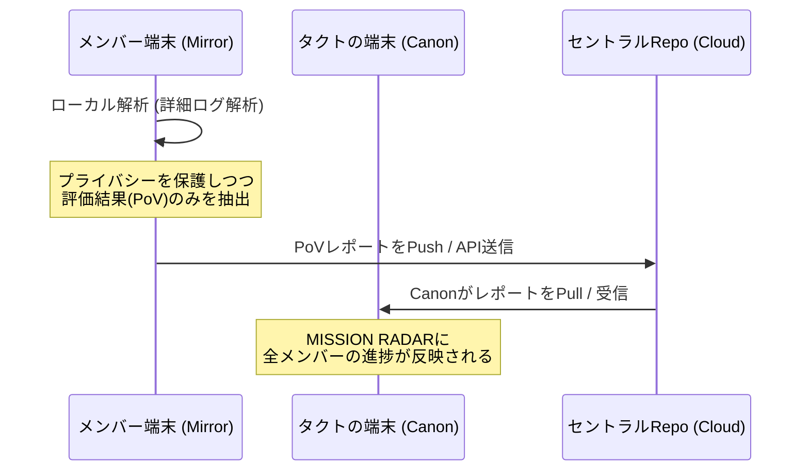

## 👥 メンバーの導線（User Journey）

1.  **導入**: メンバーが `Agent-In-The-Box` と `Ego-Mirror` を自身の端末に `git clone` する。
2.  **実働**: 普段通りエージェントを使いながら業務を行う。
    - `Beacon` が Git や CLI、オプションで Slack/ClickUp の活動を**ローカル**に貯める。
3.  **鏡のチェック**: `Ego-Mirror` がローカルで推論を実行し、本人にのみ詳細なフィードバックを返す。
    - ここで「機密情報」はフィルタリングされ、評価結果（スコア・実績）だけが抽出される。
4.  **報告 (Sync)**: 生成された **Proof-of-Value (PoV) レポート**を、中央の `Canon` へ自動送信する。
    - **送信手段**: 特定のプライベートリポジトリへの `git push` 、または Canon が提供する API への `POST` 送信。

## 🏹 情報の集約メカニズム

タクトさんの `Canon` が、なぜ離れた場所にいるメンバーの情報を収集できるのか？

### なぜこの形がいいのか？
- **プライバシー**: 生のチャットやコードの詳細はメンバーの手元に残り、タクトさんの `Canon` には「解析された結果（実績値）」だけが届く。
- **自律性**: メンバーは「自分の鏡（Ego-Mirror）」を育てることで、自分の評価が勝手に中心へ届くため、報告の手間がゼロになる。

## 📈 期待されるシナジー
- **OSSとしての価値**: `Agent-In-The-Box` を使うだけで、自動的に「市場価値を証明できるログ」が溜まり始める。
- **ポータビリティ**: 使用するエージェントが変わっても、`Ego-Mirror` の実績ログを持ち運ぶことで、場所や組織に依存しない評価を確立できる。
